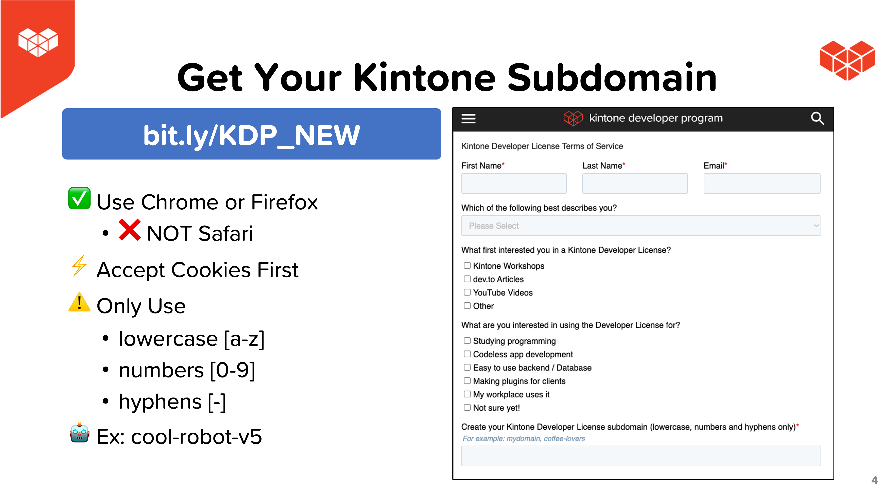

# Build a Timeline Generator using amCharts and Kintone


Learn how to make an **amCharts Timeline chart** within a **React Project** with a Kintone Database!

Thank you for attending our **Kintone x Timeline** workshop!

Our free, live workshop will walk you through creating a Web Database App, setting up a React project, and using amCharts to generate a dynamic Timeline chart!

## Outline <!-- omit in toc -->
* [Completed Project](#completed-project)
* [Get Started](#get-started)
* [Get Your Free Kintone Database](#get-your-free-kintone-database)
* [Workshop Slides](#workshop-slides)
* [Create a Kintone Web Database App](#create-a-kintone-web-database-app)
* [Create a `.env` File](#create-a-env-file)
* [Workshop Steps](#workshop-steps)
  * [Files to Edit](#files-to-edit)
  * [`...` File](#-file)
  * [Solutions to the Tasks](#solutions-to-the-tasks)
* [amCharts + Kintone References](#amcharts--kintone-references)
  * [Kintone Events](#kintone-events)
  * [amCharts Getting Started Tutorials](#amcharts-getting-started-tutorials)
  * [amCharts Animation](#amcharts-animation)
  * [Timeline](#timeline)
  * [Plugin: Bullets](#plugin-bullets)
  * [To have the PinBullets linkable to their Wiki\_URL, take a look at the following docs](#to-have-the-pinbullets-linkable-to-their-wiki_url-take-a-look-at-the-following-docs)
  * [Other Parts](#other-parts)

## Completed Project

<!-- TODO: Add a screenshot of the completed project -->

## Get Started

First, clone the [kintone-workshops/timeline-generator-amcharts](https://github.com/kintone-workshops/timeline-generator-amcharts) repo!  🚀  
Then go inside the folder.

```shell
cd Downloads

git clone https://github.com/kintone-workshops/timeline-generator-amcharts

cd timeline-generator-amcharts

npm install

npm install -g @kintone/customize-uploader
```


⚡ **Notes** ⚡  
* React requires **Node >= 14.0.0** & **npm >= 5.6**  
* Check the versions inside the `React_Workshop_by_Kintone` folder:
  * `node -v`
  * `npm -v`
* Not the correct versions or Confused? 🤔 → Check out the [Guide on Installing Node.js & npm](docs/Install_NodeJS_npm.md) Doc

⚡ Note: Please ignore the package deprecation warnings ⚡

🔎 The `npm install` command installs the required dependencies defined in the package.json files and generates a node_modules folder with the installed modules.

---

Open the `timeline-generator-amcharts` folder in [VS Code](https://code.visualstudio.com/docs/getstarted/tips-and-tricks#_command-line) as well:

```shell
code .
```

Once you are inside the folder, let's install the dependencies and open our project:

```shell
npm install

npm run dev
```

## Get Your Free Kintone Database

[bit.ly/KDP_NEW](http://bit.ly/KDP_NEW)
* ⚡ Only use lowercase, numbers, & hyphens in your subdomain
* ⚠ Do not use uppercase or special characters

|                                                                                            |                                                                                                                      |
| ------------------------------------------------------------------------------------------ | -------------------------------------------------------------------------------------------------------------------- |
|  |  |

---

## Workshop Slides

Check out the [slides.pdf](./slides.pdf) file for the workshop slides!

---

## Create a Kintone Web Database App

| Steps                                                                                  | Screenshot                                                                                                                            |
| -------------------------------------------------------------------------------------- | ------------------------------------------------------------------------------------------------------------------------------------- |
| From the Kintone portal, click the [+] button to create an App                         |                 |
| Select **Create App from Scratch** option                                              |  |
| Name the App (Ex: _Kintone Cards_)                                                     |                                                            |
| Add **Text** and **Radio Button** fields                                               |                                            |
| Open the **Text** field settings                                                       |                                    |
| Set the **Name** (`Title`) and **Field Code** (`title`)                                |                                                  |
| Open the **Radio Button** field settings                                               |                            |
| Set the **Name** (`Color`), **Options** (`Red` & `Blue`), and **Field Code** (`color`) |                        |
| Last, remember to save your changes!                                                   |                                                          |

⚠️ Warning ⚠️
* Field Code is case sensitive
* Field Code and options must be as specified in the steps, or the code will not work

---

## Create a `.env` File

1. Using the [.env.example](.env.example) file as a template, create a `.env` file.
1. Then input your Kintone credentials like the following:

```txt
VITE_SUBDOMAIN = "example"
VITE_APPID = "1"
VITE_APITOKEN = "abcdefghijklmnopqrstuvwxyz"
```

### ⚠️ DO NOT DELETE THE [.env.example](.env.example) FILE!  <!-- omit in toc -->
[.env.example](.env.example) is used by env-cmd to verify that `.env` file is correctly configured.

## Workshop Steps

### Files to Edit
1. Credentials - Create `.env` file by duplicating the [.env.example](.env.example) file
1. Frontend that builds the cards - [...](...)
1. Backend that connects with Kintone - [...](...)

### `...` File
* [ ] Task # - ...

### Solutions to the Tasks

<details>
  <summary>Task # - ...</summary>

  File: [...](...)

  ```javascript
  ...
  ```

</details>

---

## amCharts + Kintone References

Here are some references that we used to create the Timeline Chart x Kintone customization.

### Kintone Events
* [Kintone Events - `app.record.index.show`](https://developer.kintone.io/hc/en-us/articles/212494758-Record-List-Event#events)
* [Get Record List Header Element - `kintone.app.getHeaderSpaceElement`](https://developer.kintone.io/hc/en-us/articles/213148937-Get-Record-List#getHeaderSpaceElement)

### amCharts Getting Started Tutorials
* [amCharts `core.js` & `charts.js` CDN](https://www.amcharts.com/docs/v4/getting-started/basics/#CDN)
* [Working with JavaScript x amCharts](https://www.amcharts.com/docs/v4/getting-started/basics/#Working_with_JavaScript)

### amCharts Animation
* [Animation & `animated.js`](https://www.amcharts.com/docs/v4/concepts/animations/)

### Timeline
* [Timeline](https://www.amcharts.com/demos/timeline/)
* [Anatomy of a TimeLine Chart](https://www.amcharts.com/docs/v4/chart-types/timeline/)
* [Creating Timeline Charts](https://www.amcharts.com/docs/v4/tutorials/creating-timeline-charts/)
* [Customizing chart scrollbar](https://www.amcharts.com/docs/v4/tutorials/customizing-chart-scrollbar/)
* [Setting position of the chart scrollbars](https://www.amcharts.com/docs/v4/tutorials/setting-position-of-the-chart-scrollbars/)
* [Date Axis](https://www.amcharts.com/docs/v4/concepts/axes/date-axis/)

### Plugin: Bullets
* [Plugin: Bullets](https://www.amcharts.com/docs/v4/tutorials/plugin-bullets/)

### To have the PinBullets linkable to their Wiki_URL, take a look at the following docs
* [PinBullet - amCharts 4 Documentation](https://www.amcharts.com/docs/v4/reference/pinbullet/#label_property)
* [Label - amCharts 4 Documentation](https://www.amcharts.com/docs/v4/reference/label/#url_property)

### Other Parts
* [Array.prototype.map() - JavaScript | MDN](https://developer.mozilla.org/en-US/docs/Web/JavaScript/Reference/Global_Objects/Array/map)
* [Imgur API](https://apidocs.imgur.com/)
